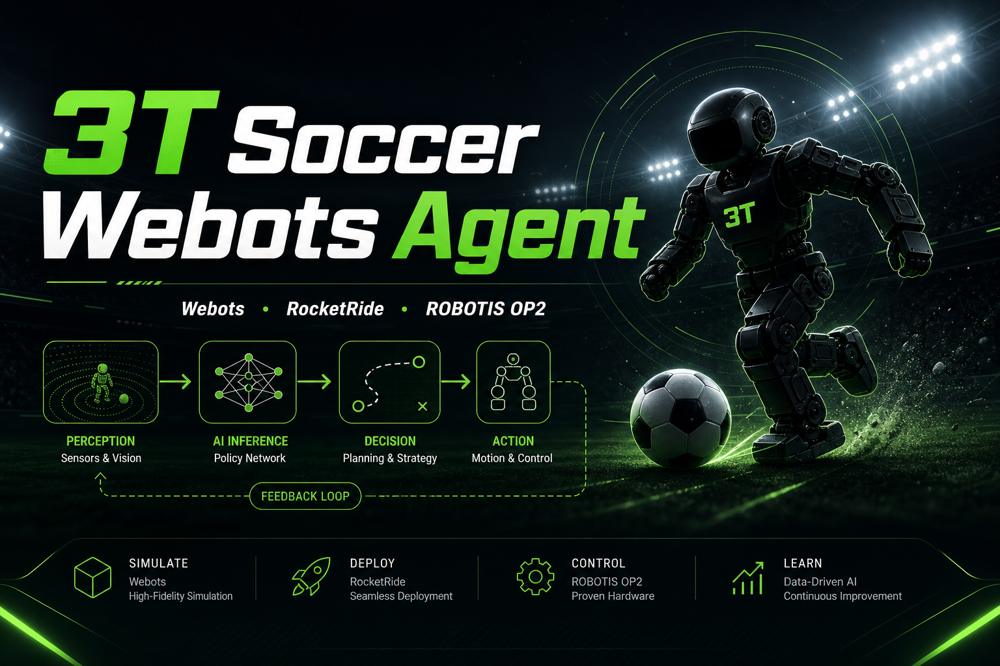
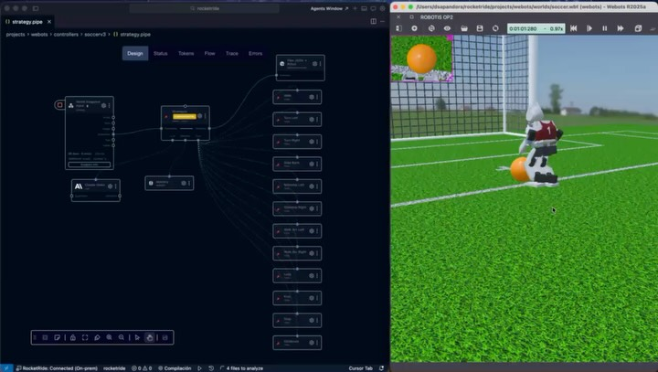
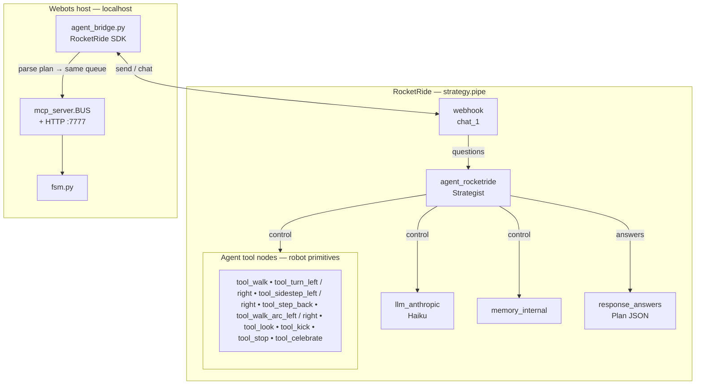
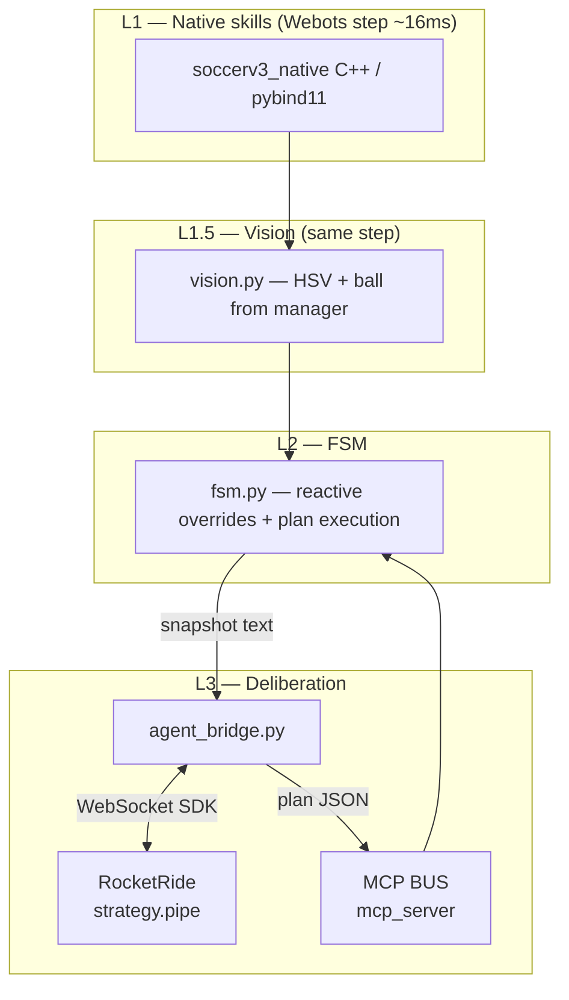
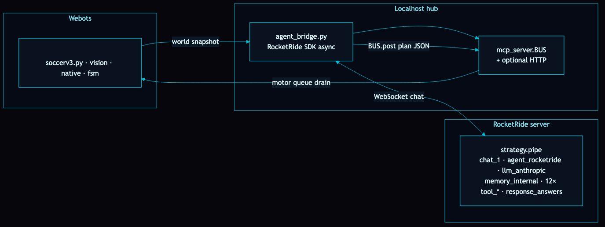
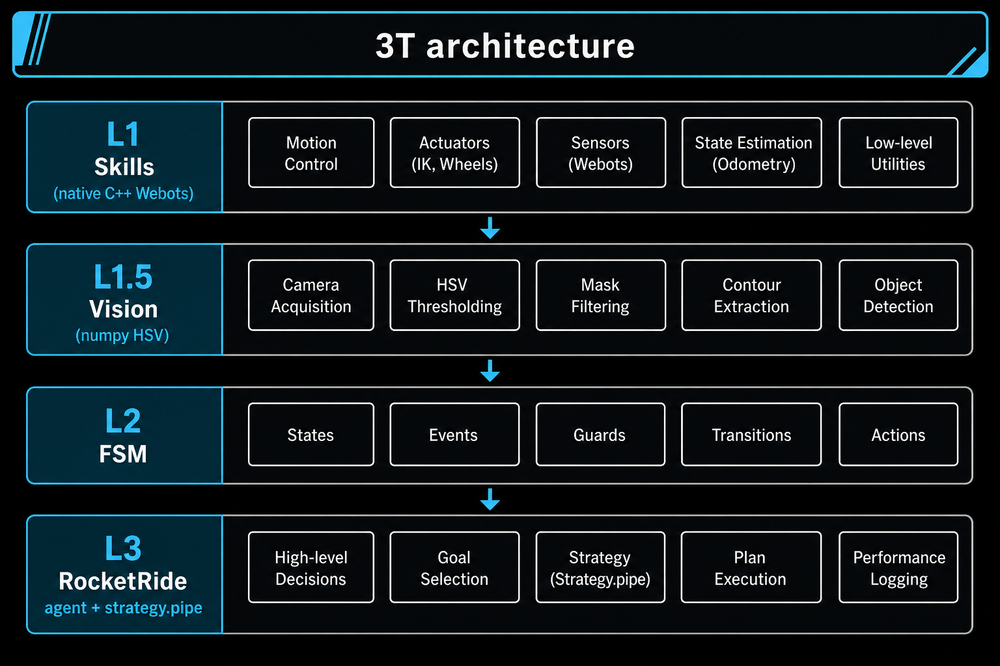

# 3T Soccer Webots Agent

**ROBOTIS OP2 soccer demo** for [Webots](https://cyberbotics.com/), extended with a **3T (three-tier) stack**: fast native skills, numpy vision, a finite-state machine, and a **RocketRide** `agent_rocketride` pipeline in [`strategy.pipe`](controllers/soccerv3/strategy.pipe) — **agent tool nodes** (`tool_walk`, `tool_kick`, …) represent each robot motion; the local **MCP** server (`mcp_server.py`) shares the same **command queue** (`BUS`) so the FSM can run plans delivered as JSON.

<p align="center">
  <a href="https://www.instagram.com/dsapandora/" title="Instagram"></a>
  &nbsp;
  <a href="https://x.com/dsapandora" title="X @dsapandora"></a>
  &nbsp;
  <a href="https://github.com/dsapandora" title="GitHub @dsapandora"></a>
</p>

<p align="center">
<table border="0" cellspacing="16" cellpadding="0">
<tr>
<td align="center" valign="middle">
<a href="https://github.com/dsapandora/3t_soccer_webots_agent" title="3T Soccer Webots Agent repository"></a>
</td>
<td align="center" valign="middle">
<a href="https://www.instagram.com/p/DYJycPejF4O/" title="Reel en Instagram"></a>
</td>
</tr>
</table>
</p>

**Author:** Ariel Vernaza ([@dsapandora](https://github.com/dsapandora)) — [ariel@lazyracoon.tech](mailto:ariel@lazyracoon.tech)

## soccerv2 vs soccerv3

| | **soccerv2** | **soccerv3** |
|---|----------------|----------------|
| **Language** | C++ controller (`soccerv2.cpp`) | Python + **pybind11** native (`soccerv3_native`) |
| **Vision** | `RobotisOp2VisionManager` (orange ball) | Same ball path **plus** `vision.py`: HSV goal + line bands on the raw camera buffer |
| **Deliberation** | Fixed reactive logic in C++ | **Layer 3**: `strategy.pipe` on **RocketRide** + `agent_bridge.py` (async SDK on a background thread) |
| **Tools** | — | **Agent tools** in RocketRide (`tool_*` in `strategy.pipe`) + **local MCP** (`mcp_server.py`, `BUS`) so `fsm.py` consumes one motor-plan queue |
| **RocketRide** | Not used | **Yes** — `ROCKETRIDE_URI`, `.env`, `strategy.pipe` next to the controller |

Use **soccerv2** as the baseline “stock demo” parity check. Use **soccerv3** when you want the **RocketRide server** to own high-level strategy while Webots runs physics at full rate.

## `strategy.pipe` — pipeline graph (agent + agent tools)

Defined in **[`controllers/soccerv3/strategy.pipe`](controllers/soccerv3/strategy.pipe)** on the RocketRide server. The **Strategist** (`agent_rocketride`) orchestrates **`llm_anthropic`**, **`memory_internal`**, and twelve **`tool_*`** nodes — each motion primitive is an **agent tool** wired with `classType: tool` (not a separate `tool_mcp_client` in this graph). The **webhook** (`chat_1`) ingests world snapshots; **`response_answers`** returns the plan JSON to the SDK.



**`agent_bridge`** reads the agent answer, extracts `{action, params, duration_ms, …}`, and **`BUS.post(...)`** so **`fsm.py`** executes the same queue whether the intent came from graph **tool_*** output or from the MCP HTTP surface.

## How it works (3T + RocketRide)



1. **Webots** calls `soccerv3.py` every simulation step.
2. **vision.snapshot** builds a compact world string (+ optional RGB for tools / MCP).
3. **FSM** either executes reactive recovery, runs the current plan timers, or **submits** a snapshot to **RocketRide** (non-blocking).
4. **`strategy.pipe`** runs **`agent_rocketride`** with **tool_*** agent tools** and **Claude**; the bridge mirrors the resulting plan onto **`BUS`** for the FSM.

### End-to-end integration (this repository)



**Figure:** [`docs/webots-rocketride-integration.png`](docs/webots-rocketride-integration.png) — **dark / cyan** poster style; the **Webots** column embeds [`docs/3t-webots-readme-banner.png`](docs/3t-webots-readme-banner.png) (OP2 + field) for a simulation-style panel like the reference art. Source: [`docs/mermaid/webots-rocketride-integration.mmd`](docs/mermaid/webots-rocketride-integration.mmd) + [`docs/mermaid/integration-neon.json`](docs/mermaid/integration-neon.json); regenerate with [`docs/mermaid/render-integration-png.sh`](docs/mermaid/render-integration-png.sh) (Node + Chromium). **Webots** sends snapshots to **`agent_bridge.py`** (WebSocket to **`strategy.pipe`**); the bridge **`BUS.post(plan)`** into **`mcp_server.BUS`**; **`fsm.py`** drains the queue. The **`strategy.pipe`** Mermaid block above stays the detailed pipeline view.

### 3T layer view



## Latency model (why plans use long `duration_ms`)

### Communication chain (one replan)

End-to-end, one decision that reaches the FSM follows roughly:

1. **FSM / bridge** packages a **snapshot** (text, bounded size).
2. **WebSocket** to RocketRide: request in, streamed / final answer out.
3. **Server pipeline** (`strategy.pipe`): **Strategist** may run several **LLM ↔ agent-tool** turns before `response_answers` returns the plan JSON.
4. **`agent_bridge`** parses the answer and **`BUS.post(plan)`** (in-process, typically **sub‑millisecond**).
5. **`fsm.py`** picks up the plan on the next control steps.

So latency is not “MCP only”: it is **network + server compute (mostly LLM) + tiny local glue**.

### Symbols

- $\Delta_{\mathrm{sim}}$ — Webots control period (often **32 ms** or **16 ms** per `step()`).
- $T_{\mathrm{net}}$ — **round-trip** WebSocket latency (client ↔ RocketRide host), including TLS and routing.
- $T_{\mathrm{srv}}$ — server-side work **excluding** the remote LLM provider’s own queue (serialization, graph scheduling, memory I/O).
- $T_{\mathrm{LLM}}$ — time inside **one** model completion the pipeline waits on (often the largest term); with **agent tools**, multiple completions may run in one user turn, so effective LLM time can be $\sum_k T_{\mathrm{LLM},k}$.
- $T_{\mathrm{tool}}$ — **agent-tool** handling inside RocketRide (arguments, routing) plus **BUS** handoff to Webots; usually $\ll T_{\mathrm{LLM}}$ unless tools do heavy I/O.

### Lower bound on one cycle

A conservative lower bound for “snapshot out → plan queued on `BUS`” is:

```math
T_{\mathrm{cycle}} \;\gtrsim\; T_{\mathrm{net}} + T_{\mathrm{srv}} + \sum_k T_{\mathrm{LLM},k} + T_{\mathrm{tool}} \,.
```

If you split the network into **uplink** and **downlink** (useful when payloads differ), you can write the same idea as $T_{\mathrm{net}} \approx T_{\uparrow} + T_{\downarrow}$ (still one RTT class in practice). **Throughput** of the snapshot matters only insofar as it stretches $T_{\uparrow}$; for this project snapshots are kept small so **RTT + LLM** dominate.

In the **cloud Anthropic** setup, $T_{\mathrm{LLM}}$ is often **seconds** per completion, so $T_{\mathrm{cycle}}$ is **seconds**. The FSM **open-loops** gait/motion for **`duration_ms`** in the plan while the next cycle runs — `strategy.pipe` instructions push **multi-second** primitives so the robot does not stop every step waiting for the cloud.

### Why a **local** (or LAN) model can feel better

If the **same** RocketRide graph calls an LLM hosted **on your machine** or **on the same LAN** as the server:

- $T_{\mathrm{net}}$ between Webots and RocketRide is unchanged unless you also move the **client**; but $T_{\mathrm{LLM}}$ often drops sharply (no wide-area hop to a vendor API, smaller queuing variance, optional GPU batching).
- $\sum_k T_{\mathrm{LLM},k}$ may fall from **seconds** to **hundreds of milliseconds** for a small model, so you can afford **shorter** `duration_ms` or slightly **faster** replans — still bounded by $\Delta_{\mathrm{sim}}$ and stability of the gait.

Trade-offs: **hardware** cost, **model quality** vs. cloud frontier models, and **ops** (you host weights and limits). The math is the same; only the magnitudes of $T_{\mathrm{LLM}}$ and sometimes $T_{\mathrm{net}}$ change.

**GitHub:** inline math uses `$…$` — the opening `$` must touch the first TeX token (no space). For display math, use a fenced code block with language tag `math` (recommended in `.md` files) or `$$` on dedicated lines — see [Writing mathematical expressions](https://docs.github.com/en/get-started/writing-on-github/working-with-advanced-formatting/writing-mathematical-expressions).

## Vision math (soccerv3 `vision.py`)

**BGRA → RGB** (Webots buffer) reshapes to $H\times W\times 3$ and swaps channels.

**RGB → HSV** (vectorised, $R,G,B\in[0,1]$):

Let $M=\max(R,G,B)$, $m=\min(R,G,B)$, $\Delta=M-m$. Saturation $S=\Delta/M$ (with $0$ when $M=0$), value $V=M$. Hue $H\in[0^\circ,360^\circ)$ follows the usual piecewise branch on which channel equals $M$ (implemented in `_rgb_to_hsv`).

**Ball** — reuses the **ROBOTIS** manager (same idea as soccerv2): centre $(x,y)$ in **normalised image coordinates** with $y\to +1$ toward the robot’s feet.

**Goal (white)** — mask pixels with low saturation and high value in the **upper** band, count pixels $\geq$ `GOAL_MIN_PIXELS`, centroid $(\bar x,\bar y)$ mapped to $[-1,1]$ with $x'=2\frac{\bar x}{W}-1$, $y'=2\frac{\bar y}{H}-1$.

**Lines** — same white mask restricted to the **bottom** `NEAR_LINE_BAND_RATIO` of the frame; `coverage` is the fraction of masked pixels; left/center/right compares column thirds.

## Repository layout

```
controllers/
  soccerv2/          # C++ baseline (RocketRide-free)
  soccerv3/          # Python + native + RocketRide + MCP + vision
libraries/           # ROBOTIS OP2 managers (shared)
worlds/              # soccer.wbt, assets
patches/
  rocketride-server/ # diff + scripts to align engine with Webots agent nodes
```

## Quick start (soccerv3)

See **[controllers/soccerv3/SETUP.md](controllers/soccerv3/SETUP.md)** for `make`, `make check`, Webots `runtime.ini`, and troubleshooting.

Summary:

```bash
cd controllers/soccerv3
make && make check
# In Webots: assign controller soccerv3 to the OP2 robot, press Play.
```

Copy **`.env.example` → `.env`** beside the controller and point **`ROCKETRIDE_URI`** / **`ROCKETRIDE_APIKEY`** at a server (see **ROCKETRIDE_QUICKSTART.md** in the RocketRide extension docs: `connect` → `use` → `send` / `chat`) built from **`rocketride-server`** with the **AGENT-WEBOTS** changes (see patch folder below).

## Patch: `rocketride-server` **AGENT-WEBOTS**

Clone **[rocketride-server](https://github.com/rocketride-org/rocketride-server)** (`develop`), then apply the **unofficial node** diff shipped in this repo:

- **`[patches/rocketride-server/rocketride-server-AGENT-WEBOTS.patch](patches/rocketride-server/rocketride-server-AGENT-WEBOTS.patch)`** — **Only** `nodes/…` + small flow tests (`agent_rocketride`, `tool_*`, `gpt_image_edit`, `openai_files_upload`). Same content as regenerating from **`AGENT-WEBOTS`** excluding `examples/` / `docs/plans/` (see patch README).

**[patches/rocketride-server/README.md](patches/rocketride-server/README.md)** — `git apply` steps and **`generate-agent-webots-patch.sh`** to regenerate the nodes patch from your `AGENT-WEBOTS` clone.

After applying, rebuild and deploy the server, then connect this controller.

## Pipeline file

- **[controllers/soccerv3/strategy.pipe](controllers/soccerv3/strategy.pipe)** — RocketRide graph: `webhook` → `agent_rocketride` with **control** edges to `llm_anthropic`, `memory_internal`, and **`tool_*`** motion nodes → `response_answers`. Upload to your server workspace next to other `.pipe` files as usual.

## Build notes (shared C++ libs)

See **[MAKEFILE_NOTES.md](MAKEFILE_NOTES.md)** for Webots include paths (`WEBOTS_HOME`) and linker quirks.

## License / upstream

Webots sample code retains **Cyberbotics** and upstream **ROBOTIS** licensing where applicable; new Python/RocketRide layers follow this repository’s intent (MIT-friendly demo — confirm headers before redistributing bundled SDK snippets).

---

<p align="center">
  <sub>Powered by <a href="https://github.com/rocketride-io">RocketRide</a></sub>
</p>
